# Assignment - 3 : Structure from Motion
### Name: Sanjaii Vijayakumar
### UNI: sv2851
### Professor: Aleksander Holynski

We are going to do the most difficult task out of all: reconstruct objects in 3D from 2D images using epipolar geometry. SfM is one of the most popular algorithm for reconstructing images into sparse and dense point clouds and used extensively in almost all the photogrammetry softwares like MetaShape.

Let me show the staff images that we are going to work with: 

  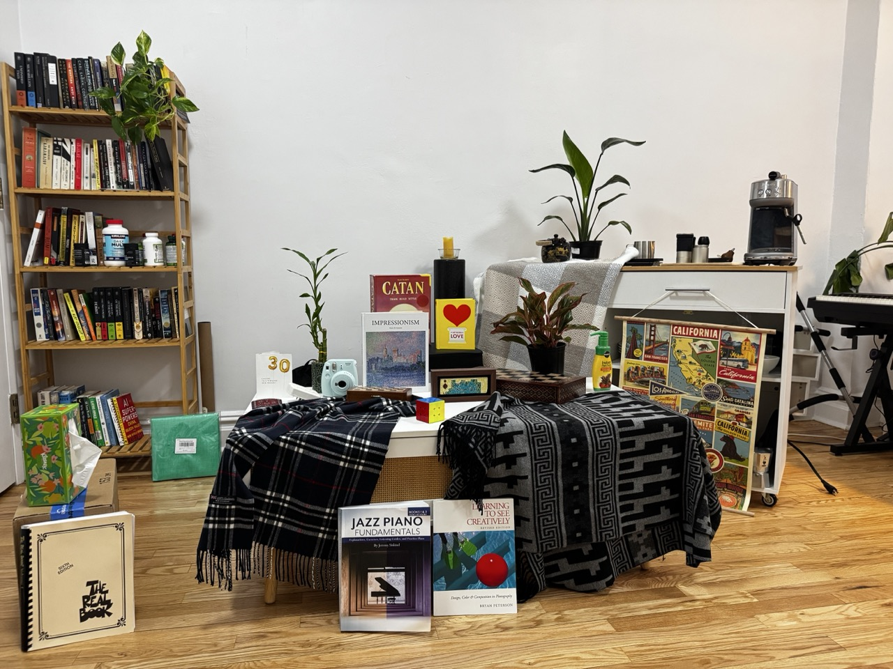
  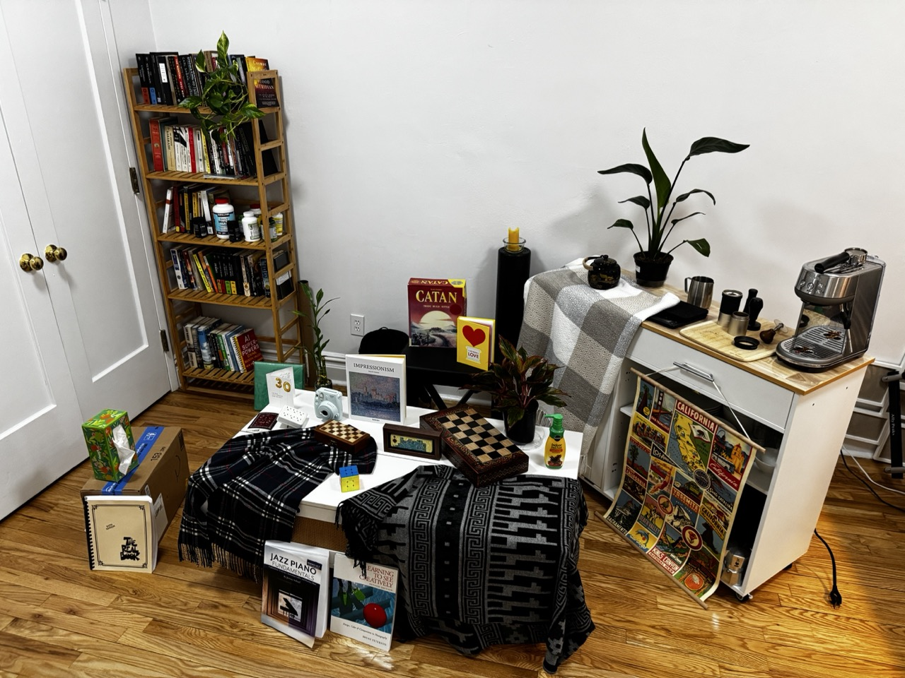

  <em>(a) Camera 1 View</em>
  <em>(b) Camera 2 View</em>

Lets jump right in. 

## Step 1: Computing intrinsics of the camera

The camera intrinsics is the parameters of the camera with which we take the pictures. Every camera has these parameters: the focal points and the principal points. As the values of the physical focal length, camera's height and width are given, we can easily plug it into the formula and return the intrinsic matrix, that we also label as K. 

The dimensions of the images are 1280 X 960, and so it is plugged into the code and we get this intrinsic matrix: 

  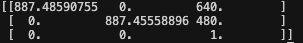

  <em>(a) Intrinsic Matrix</em>

## Step 2: Detecting SIFT features

Remember, we did harris point feature detectors in HW2 and used it to manually calculate the descriptors and the keypoints 'worthy' enough of being used to match? Yeah, we are not going to do that. Instead, we are going to use SIFT features, that extracts the feature descriptors and the keypoints for the images in a much more efficient way. 

Here are the results from running the SIFT algorithm on the staff images, 

  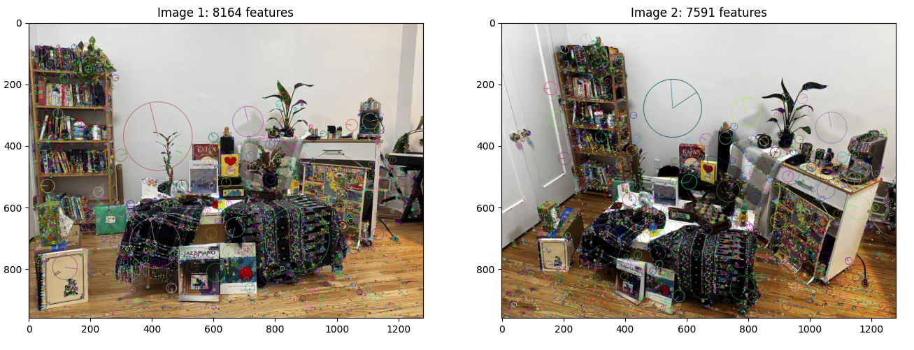

  <em>(a) SIFT keypoints shown with the circle denoting the rotation of the pixel</em>

Fortunately, the default parameters for the SIFT algorithm were good enough for us to generate enough keypoints. The parameters are: 
* nfeatures: 0
* nOctaveLayers: 3
* contrastThreshold: 0.04
* edgeThreshold: 10.0
* sigma: 1.6

The algorithm generated 8164 keypoints for image 1 and 7591 keypoints for image 2. And that is a lot of candidate points!!

## Step 3: Feature matching

Just as we did in HW2, we are going to perform the Lowe's Test to identify if the candidate descriptors that we calculated can actually be chosen as the keypoint for the images. Instead of building that manually, we are using cv2.BFMatcher (Brute Force Matcher) that matches the descriptors with the closest value. 

I used a slightly stronger threshold, i.e 0.8 because I wanted the points to be stricter than usual. Here are the results from running NNDR:

  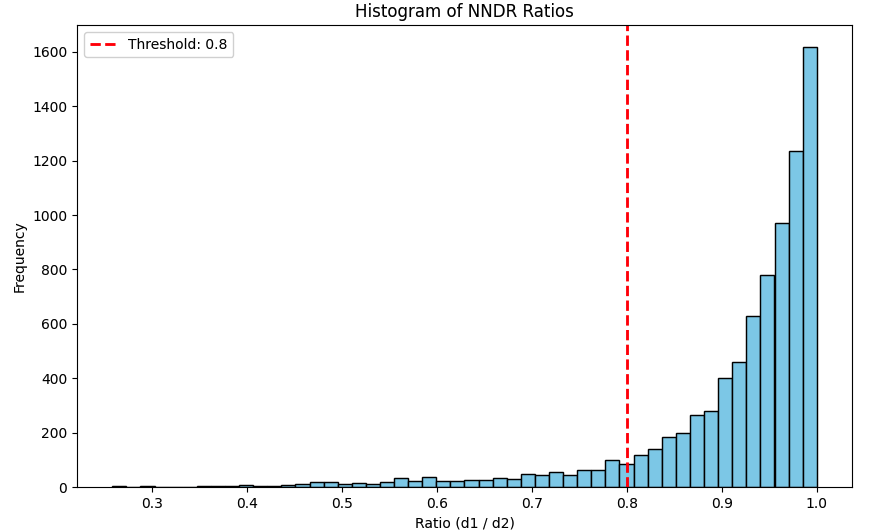
  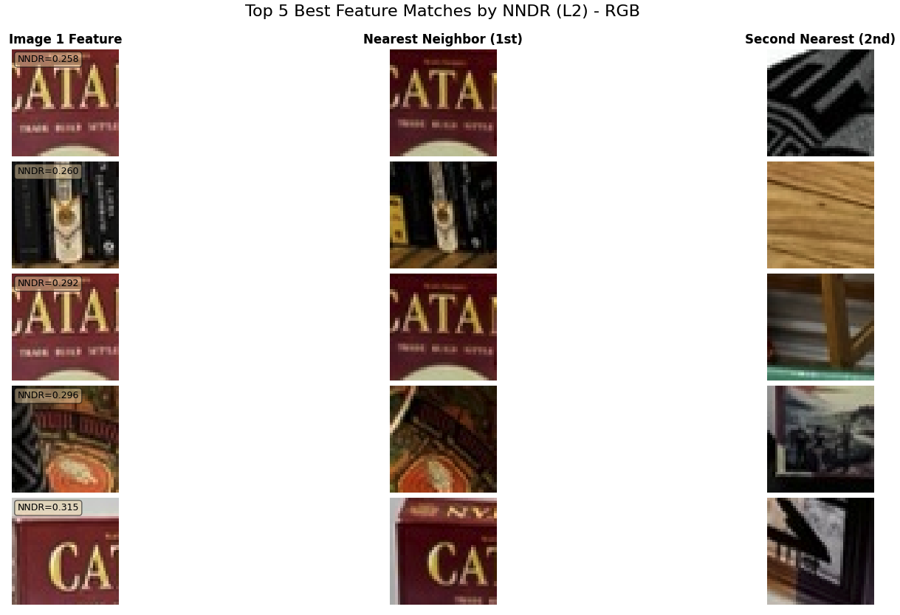
  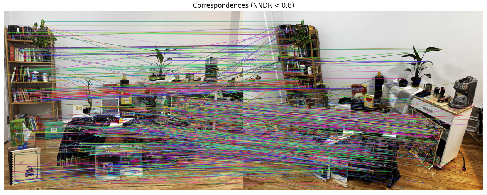

  <em>(a) The histogram depicting the NNDR ratio</em>
  <em>(b) NNDR ratio table of the top 5 descriptors</em>
  <em>(c) Correspondence between the two images with the best descriptors</em>

## Step 4: RANSAC to find the epipolar lines 

This part actually broke me. I could not for the love of god, find a right way to do it. Took me a whole day but figured out somehow. The RANSAC algorithm runs through a certain number of times searching for the best fit of the epipolar lines between the two images. The epipolar lines give us a description of the rotation and the translation of a pixel between two different images. 

I did not run a post-processing pipeline after running the RANSAC. But, here are the parameters for running the RANSAC that I chose: 

* Number of iterations = 2000
* Sampson Distance threshold = 0.005
* Number of inliers found = 718 (which is plenty!!)

Here are the results:

  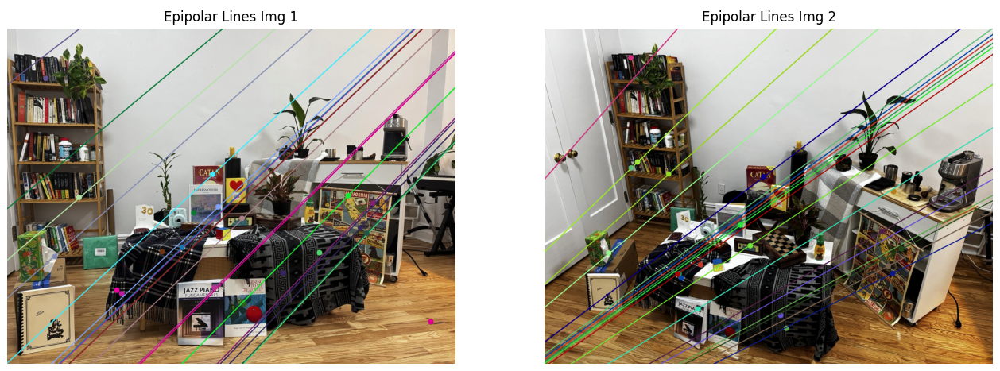
  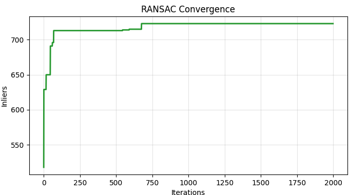
  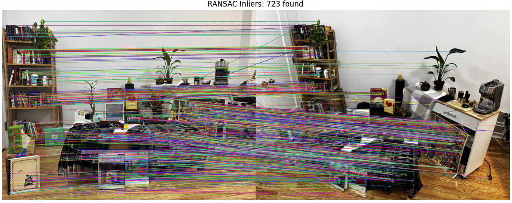

  <em>(a) The epipolar lines</em>
  <em>(b) Ransac convergence over 2000 iterations</em>
  <em>(c) Visualizing the correspondences after RANSAC</em>

## Step 5: Triangulation and point cloud

Here we are. Finally. At the pinnacle of reconstruction. All we need to do now is to triangulate the points in 3D space, and then project the points between the two images, and this would start to recreate the pixels in 3D. We will only be using the inliers from the RANSAC, and it makes sense, because these points are the one that fit as the best points to be projected onto the 3D space.

We are told to use Vizer, a visualization tool, to visualize the point clouds and that is what we are going to do. 

  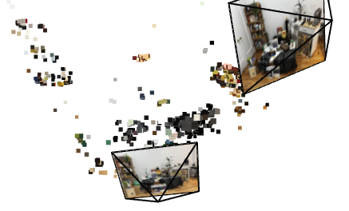
  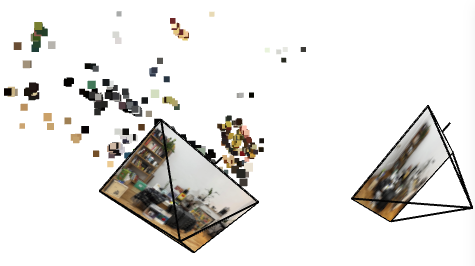
  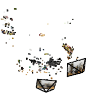

  <em>(a) I see the black neck scarves laid out</em>
  <em>(b) I see the yellow poster thats hanging behind the black scarves</em>
  <em>(c) I dont know what I am seeing but here you go...</em>

